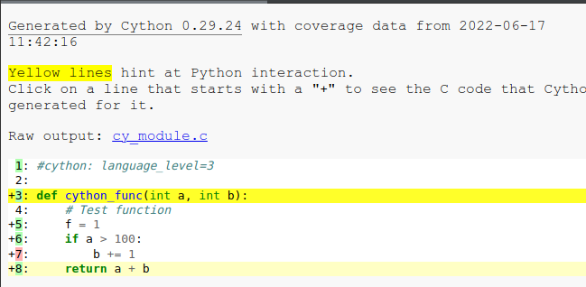
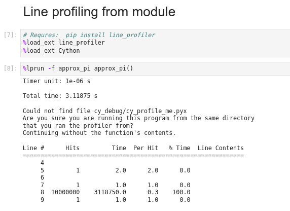
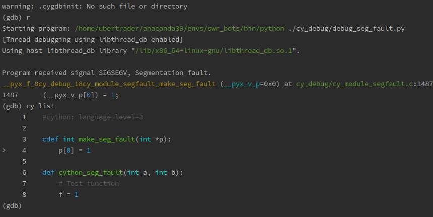

# Cython dev boilerplate

A simple project structure which can help to develop and debug high performance cython code.

Developing in cython is quite challenging, the information is very sparse and hard to figure out how to setup things properly 
to make process more convenient.  

## Features
1. Support of building cython project with debug information, which allows debugging weird stuff like segmentation faults, run line profiler and tests
2. Added `make` file which does all the magic. 

### Main commands
* `make build-debug` - force rebuilding all cython code with debugging information, including for line-tracing / line profiling, GDB / cygdb debugging
(segmentation faults, breakpoints), code coverage, also produces html annotation nearby each `.pyx` file  
* `make build` - makes production code, without debug information
* `make tests [p=.]` - makes production code, and run all tests, `[p=]` optional path to package or module
* `make tests p=cy_debug` - makes production code, and run all tests, at specific package
* `make tests p=cy_debug/tests/test_cy_debug.py` - makes production code, and run all tests, at specific file
* `make coverage [p=.]` - makes cython code coverage reports, you can found them in `<cython_fn>.html` files nearby each `.pyx` file
* `make debug-file p=` - runs python file (which may call cython in main()) in GDB debugger with Cython support, for example
`make debug-file p=./cy_debug/debug_seg_fault.py` **IMPORTANT** when you see (gdb) prompt you should type `r` or `run` to launch execution.
* `make debug-tests [p=.]` - run all or selected by `p=` tests under debugger (you need to type `run` when see the (gdb) prompt)
* `make cleanup` - cleans all temporary files including compiled libraries, you must explicitly `make build` after cleanup  

## Requirements
1. Linux OS, or you could amend the script for supporting other OS
2. Anaconda python

## Installation
1. You can use the project structure as boilerplate in your projects
2. Useful files
   1. `setup.py` - smart compilation and debug info
   2. `Makefile` - how does it work under the hood
   3. `.coveragerc` - added for supporting Cython coverage   
3. `scripts` folder contains installation scripts for compiling debug Python version, which is not needed in 99% cases. As well as GDB compilation from sources. 

## Coverage report

## Line profiler in Jupyter
[Example Jupyter noteboor with profiling](./examples/cython_notebook_profile.ipynb)

## Cython debugger segmentation faults
